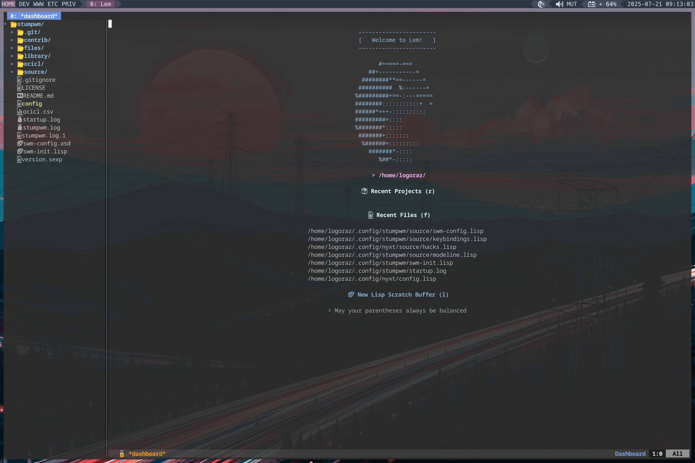
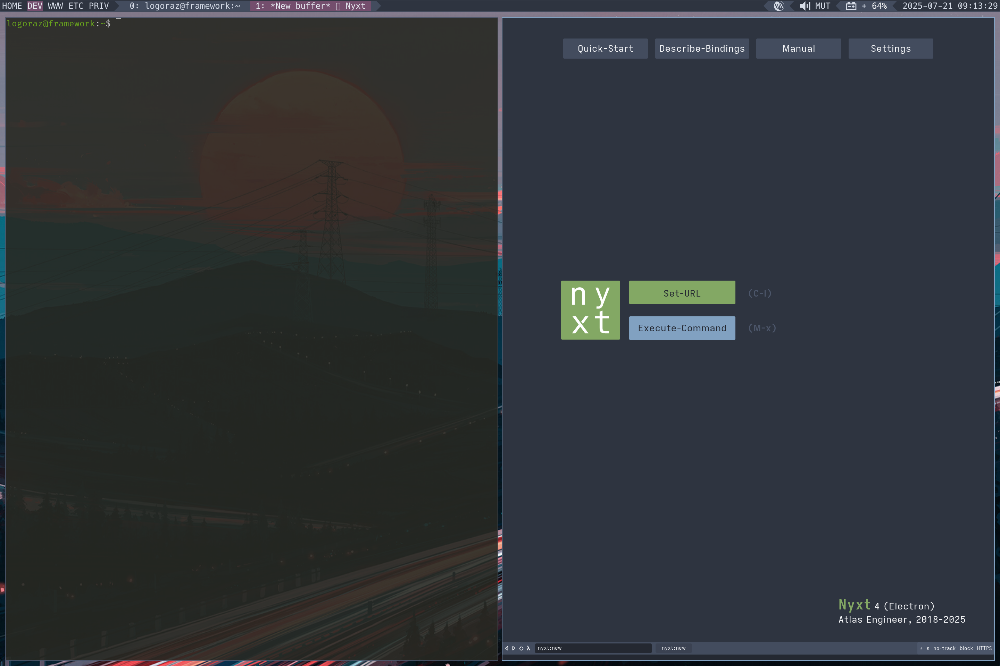

# StumpWM Configuration

<p align="center">
  
</p>


## `[Cr]`ystallized `[Mo]`mentum

My StumpWM configuration with batteries included! This StumpWM configuration was
ported from my Guix configuration so that I can use it on my Fedora setup. This
is used along side the default Gnome Desktop that ships with Fedora.

Note that this work is still a work in progress, it still works very nicely,
however, is currently missing some features (wifi module) and CPU modeline
utility errors on mode line string expansion - I am working to fix these to
have a similar full-experience I had on my Guix configuration for StumpWM.

Lastly, this configuration [Cr]ystallized [Mo]mentum is setup as its own CL
System. This provides me the modularity to define my own library systems
as well as download and have my contrib modules all within the same repo.
Also, the System is initially setup and loaded in `swm-init.lisp --> config`
with a nice error-handling configuration, so as to never stop StumpWM load
on error (just limited functionality) and then one can look at the log files
to troubleshoot.


## Screenshots






## Project Overview

```lisp
    stumpwm/                   ;; StumpWM Config [Cr]ystallized [Mo]mentum
    |- config.lisp
    |- swm-config.asd
    |- files/                  ;; Xorg environment files
       |-assets/
       |-xorg/
         |- dot-Xdefaults
         |- dot-Xresoures
         |- dot-xsession
         |- dot-icons/         ;; XcursoPro-Dark --> ~/.icons
         |- fonts/             ;; --> ~/.local/share/fonts/
         |- start-xterm.sh
         |- stumpwm.desktop
    |- source/                 ;; modularized config 'scripts'
       |- swm-config.lisp
       |- syntax.lisp
       |- theme.lisp
       |- frames.lisp
       |- keybindings.lisp
       |- modeline.lisp
       |- utilities.lisp
    |- library/                ;; Adapted contrib & personal modules
       |- swm-wpctl/
       |- swm-end-session/
       |- swm-screenshot/
       |- swm-bluetooth/       ;; WIP
       |- swm-brightness/
       |- swm-wify             ;; WIP clone of stumpwm wifi contrib to work with wi
       |- wip-swm-nmctl/       ;; Wish list item
```


## Fedora Dependencies
To use this alongside the default Gnome desktop that ships with Fedora, you will first
need to isntall X11:

``` bash
$ sudo dnf install @base-x
```

Next, let's install all the X11 utilities & related programs that this StumpWM configuration
needs to work out-of-the-box:

``` bash
$ sudo dnf install xrandr xinput xsetroot xset xss-lock slock xclip xterm \
                   feh picom brightnessctl playerctl
```

Lastly, we'll need to add RPM Fusion to our system to install `transset-df`:
1. Add RPM Fusion to your system:
   see https://docs.fedoraproject.org/en-US/quick-docs/rpmfusion-setup

2. Download latest rpmsphere-release rpmm from
   https://github.com/rpmsphere/noarch/tree/master/r

3. Download rpmsphere-release rpm:

``` bash
$ rpm -Uvh rpmsphere-release-40-1.noarch.rpm
```

4. Then install `transset-df`

``` bash
$ sudo dnf install transset-df
```


## Building & Install StumpWM

1. Download [StumpWM](https://github.com/stumpwm/stumpwm)

2. Build - I am using [ocicl](https://github.com/ocicl/ocicl) to manage system
   dependencies:
   - First ensure you have either an `init.lisp` or `.sbclrc` configured for
     lisp and StumpWM - note that StumpWM requires `sb-rotate-byte` and `sb-cltl2`
     sbcl external libraries to be activated in your lisp image for it to work
     properly (oddly this isn't stated anywhere in their instructions)...

     ```lisp
     (ignore-errors (require :asdf)
                    (require :uiop)
                    (require :sb-rotate-byute)
                    (require :sb-cltl2)
     #-ocicl
     (ignore-errors
       (when (probe-file (uiop:xdg-data-home #P"ocicl/ocicl-runtime.lisp"))
         (load (uiop:xdg-data-home #P"ocicl/ocicl-runtime.lisp")))
       (asdf:initialize-source-registry
        (list :source-registry
         ;; Needed to store non-available ocicl systems in ocicl/
         (list :tree (uiop:getcwd))
         :inherit-configuration)))
     ```

   - Next `$ cd path/to/stumpwm/` then perform `> (asdf:load-system :stumpwm)`
     to have ocicl download all CL system dependencies. This will fail out at
     the end if you are on the Gnome side - this is fine as we only want the
     dependencies downloaded

   - Build & Install StumpWM as prescribed:
     ```bash
     $ cd /path/to/stumpwm/
     $ ./autogen
     $ ./configure
     $ make
     $ sudo make install
     ```

3. To be able to select within GDM, you will need to create a stumpwm.desktop file
   and place in `/usr/share/xsessions/` - this repo already ships with that, just
   modify and `cp ./files/xorg/stumpwm.desktop /usr/share/xsessions/stumpwm.desktop`


## References:

  - [StumpWM Configuration Inspiration](https://config.phundrak.com/stumpwm)
  - [ocicl](https://github.com/ocicl/ocicl)
  -
